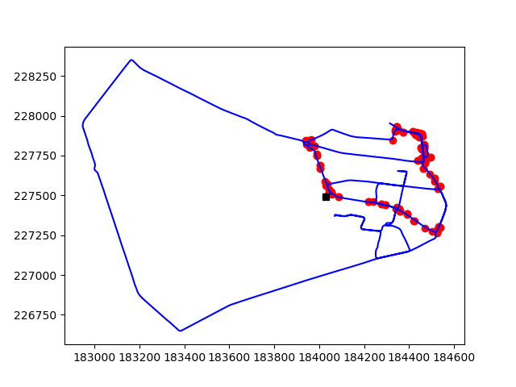
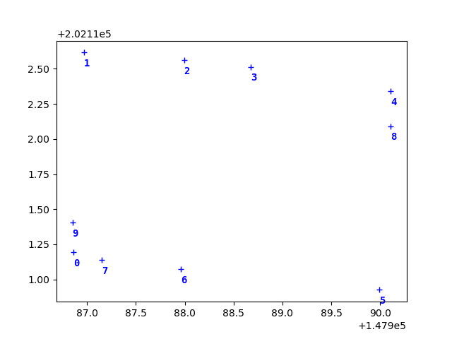
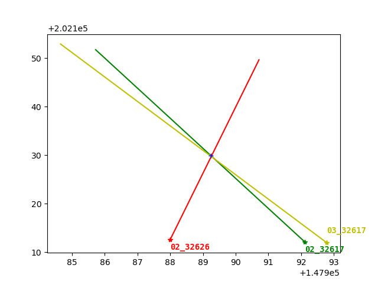

# Multi-view Detection and 3D Localization of Belgium Traffic Sign 
This repo aims to parse the 3D mapping sequences of [BelgiumTS Dataset](https://btsd.ethz.ch/shareddata/), and solve the 3D localization using [Triangulation](https://www.wikiwand.com/en/Triangulation_(computer_vision)) and [Sparse Bundle Adjustment](https://scipy-cookbook.readthedocs.io/items/bundle_adjustment.html).  

---
## Dataset 
This repo uses the [Test sequences](https://btsd.ethz.ch/shareddata/BelgiumTS/Seqs_poses_annotations.tar.gz), which include the ground truth 3D position of each detected traffic sign _sequence*\_GT.txt_ in 4 sequences, parameters (intrinsic matrix, distortion, rotation, translation) _camera\_set.txt_ of 10 cameras, extrinsic parameters _*.poses_ (rotation and translation in world coordinate) of each sequence.

---
### Sequence
The sequence file contains the annotations of detected poles and the traffic signs on each poles. It has the 3D coordinates of the poles, annotated bounding boxes (2D coordinate, upleft, downright) for each traffic sign and 3D center coordinates for each traffic sign.

---
### Camera parameters
The camera set file contains all parameters for the camera model, including intrisic calibration matrix **K**, 3 radial distortion parameters, rotation matrix **Rc**, and translation vector **tc**. Specifically, **Rc** and **tc** are mapping from the camera coordinate (origin at the camera center) to the car coordinate (origin at the car center). _Check camera.pdf_.  
Here is the relative position of cameras. 

---
### Poses parameters
The poses file contains extrinsic parameters (rotation matrix **Rw** and translation vector **tw**) of every frame in each sequence. Specifically, **Rw** and **tw** are mapping from the car coordinate (origin at the car center) to the world coordinate (origin at the starting point).

---
## Triangulation
This step localize the traffic sign by back projecting the centers of bounding boxes and finding the intersections with optical rays.  

---
## Sparse Bundle Adjustment
Since there is a set of detected images with corresponding 3D points (traffic sign), I make use of the sparcity of the Jacobian when optimizing the bundle adjustment. More details can be referred to [Large-scale bundle adjustment in scipy](https://scipy-cookbook.readthedocs.io/items/bundle_adjustment.html).

---
## License & Copyright
© Bailiang Jian  
Licensed under the [MIT Licensce](LICENSCE)
